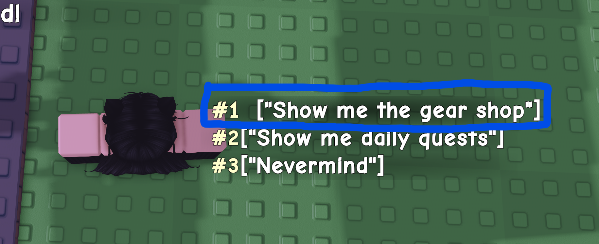
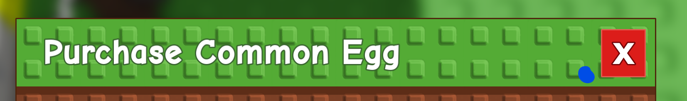

This is a macro for the hit Roblox game Grow a Garden.
# How to Use
1. Run the `main.exe` file. The decompiled `main.ahk` file is included for reference, or if you want to add your own modifications.
2. Make sure that shiftlock is set to **off** and your camera mode is set to **Default (Classic)** and your movement mode is **Default (Keyboard)**.
3. The Recall Wrench should be in your **2nd** hotbar slot, and should not be equipped. The macro will automatically equip it when needed.
4. In order to run the macro, make sure that you click the "Set Config" button and follow the directions on-screen. This needs to be done only once, but can be done as many times as you want. This allows for certain variables to be set that cannot normally be changed by the user via the UI.
# Features
* Automatically buys seeds, gear, and eggs (duh)
* Automatic character alignment
* Automatic camera alignment
* Failsafe checks to ensure that the macro does not run when it shouldn't
# settings.ini
* `kill_key`: The key to press to stop the macro. Default is `F6`.
* `show_tooltips`: Whether to show tooltips in the UI. Default is `true`.
* `window_failsafe`: When enabled, the macro will only run if Roblox is in focus. Default is `true`.
* `internet_failsafe`: When enabled, the macro will terminate if disconnected from the internet. Default is `true`.
* `shop_timer`: Time between checks of the seed and gear shops. Default is every `300` seconds since midnight.
* `egg_timer`: Time between egg checks. Default is every `1800` seconds since midnight.
* `grace`: Seconds between pressing the start button and the macro actually starting. Default is `5` seconds.
# Config setup
* The config setup is done by clicking the "Set Config" button in the UI, and it must bedone before your first run of the macro. If not done, the macro will let you know and it will not run.
* These are the points that the macro will ask you for:

| Name               | Image                                                                 | Notes                              |
|--------------------|-----------------------------------------------------------------------|------------------------------------|
| `gear_enter_point` |          | Anywhere inside the blue rectangle |
| `egg_top_corner`   |                 |                                    |
| `egg_bottom_corner`|        |                                    |

# Tips
* I would **HEAVILY SUGGEST** sitting by your computer while the macro runs its first run, just to make sure that it works as intended.
