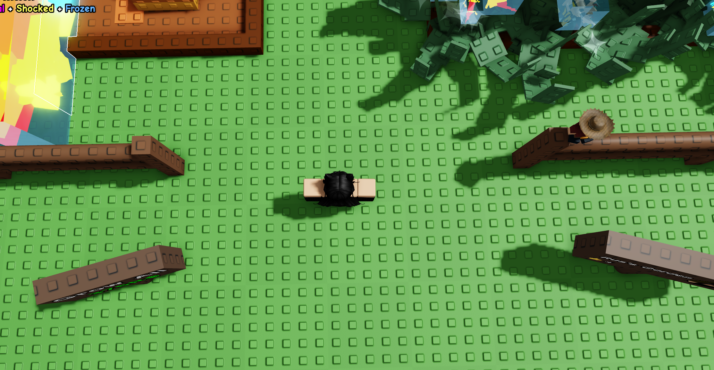

This is a macro for the hit roblox game Grow a Garden.
# How to use
1. Make sure that your camera is positioned like so:

Try to have the camera as level as possible. The camera must be DIRECLY ABOVE your character.
2. Make sure that the Recall Wrench is in your **2nd** slot and is not equipped when the macro starts.
3. In order to run the macro, make sure that you click the "Set Config" button and follow the directions on-screen. This needs to be done only once, but can be done as many times as you want. This allows for certain variables to be set that cannot normally be changed by the user via the UI.
# settings.ini
* `kill_key`: The key to press to stop the macro. Default is `F6`.
* `show_tooltips`: Whether to show tooltips in the UI. Default is `true`.
* `window_failsafe`: When enabled, the macro will only run if Roblox is in focus. Default is `true`.
* `shop_timer`: Time between checks of the seed and gear shops. Default is every `300` seconds since midnight.
* `egg_timer`: Time between egg checks. Default is every `1800` seconds since midnight.
* `grace`: Seconds between pressing the start button and the macro actually starting. Default is `5` seconds.
# Tips:
* I would **HEAVILY SUGGEST** sitting by your computer while the macro runs its first run, just to make sure that it works as intended.