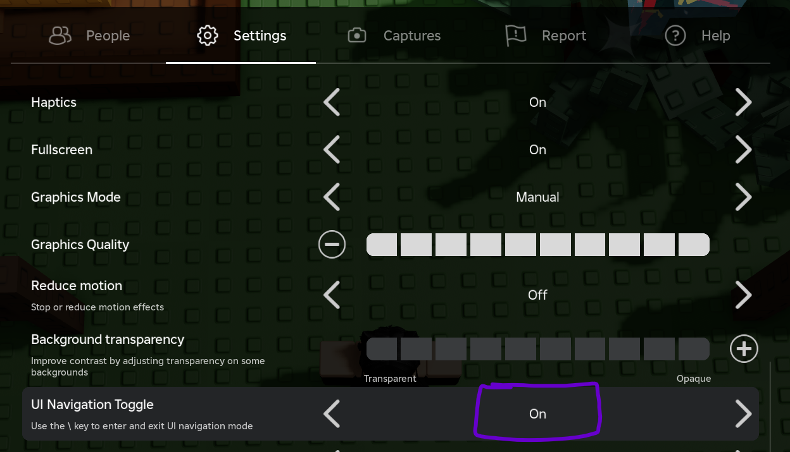
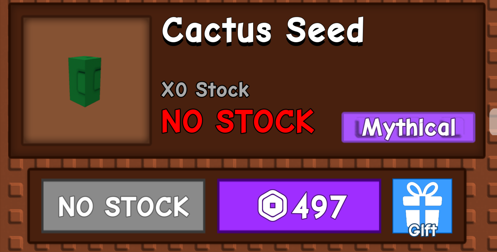
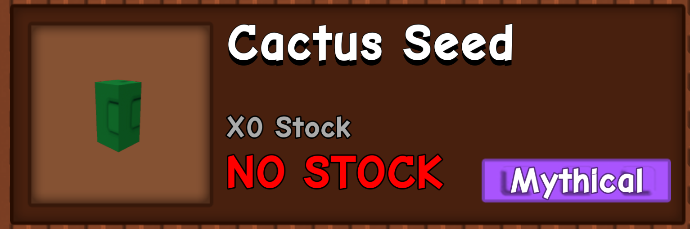

**IMPORTANT!**
You may NOT use a different font while using this macro. This is because this macro uses image recognition for certain tasks, and the font must be the same one used in the game.
# How to use
1. Make sure that your camera is positioned like so:

Try to have the camera as level as possible. The camera must be DIRECLY ABOVE your character.
2. Make sure that the ui navigation toggle is set to "On".

3. Make sure that this is selected by the UI navigation toggle: (use WASD/arroy keys to move to there)

4. Make sure that the game is in fullscreen mode.
5. Make sure that the Recall Wrench is in your **2nd** slot and is not equipped when the macro starts.

6. Start the macro by clicking the "Start" button in the UI.
**Make sure that there are no selected seeds or gears in the shop!**
Bad:

Good:

Also: make sure that your last prior selected seed was carrot, and your last prior selected gear was watering can, before starting the macro
# config
The config file is located at `config.json`. It contains the following:
* `buy_counts`: A dictionary of seeds and gears and their respective counts to buy.
* `seeds`: A dictionary of seeds and whether to buy them or not.
* `gears`: A dictionary of gears and whether to buy them or not.
* `kill_key`: The key to press and hold to stop the macro. Default is `F6`. It is not that reliable, so if it does not work, move the cursor to the top left corner of the screen and the program will terminate.
* `shop_timer`: Time between checks of the seed and gear shops. Default is every `300` seconds since midnight.
* `egg_timer`: Time between egg checks. Default is every `1800` seconds since midnight.