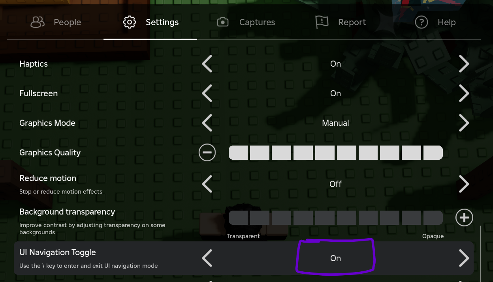
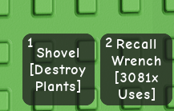

How to use:
1. Make sure that your camera is positioned like so:

Try to have the camera as level as possible.
2. Make sure that the ui navigation toggle is set to "On".

3. Make sure that the game is in fullscreen mode.
4. Make sure that the Recall Wrench is in your **2nd** slot and is not equipped when the macro starts.

5. Start the macro by clicking the "Start" button in the UI.